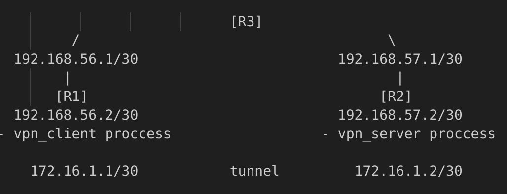
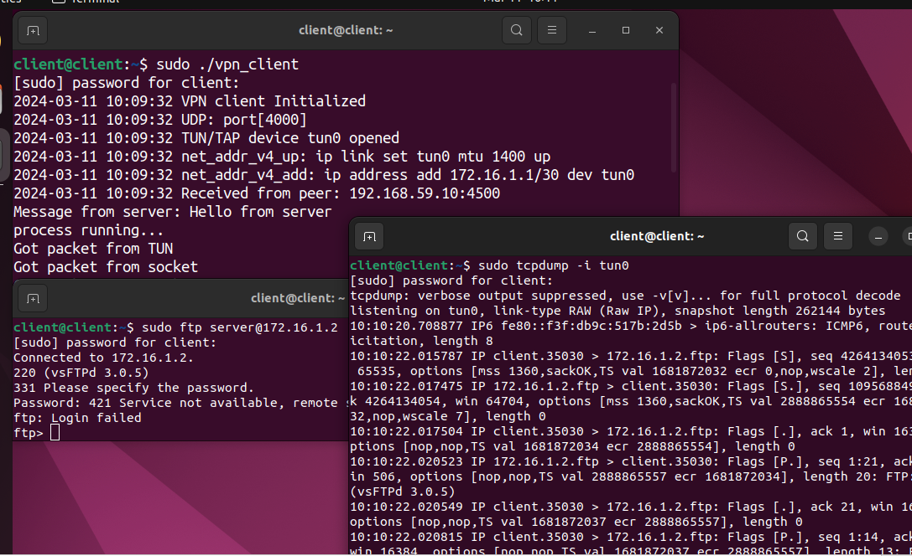
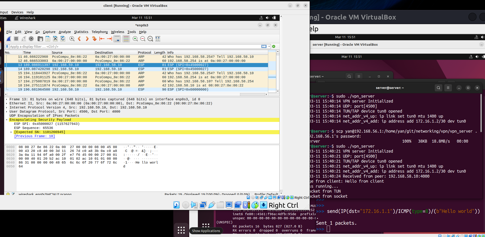

## VPN client/server implementation:

The topology:



### VPN server program flow:
- Init(PORT)
  - create UDP socket (SOCK_DGRAM)
  - bind socket to IP and port
  - return struct_handle
- CreateTunDev()
  - ifreq struct - create and init virtual network interface tun0
  - ioctl - set attributes of network interface associated with fd.
  - return tunfd
- Ifconfig()
  - configure tun0 MTU and IP address
- ServerConnection(handle)
  - init client address struct, to receive data from client
  - recvfrom() client Hello messgae
  - sendto() client server Hello message
  - SetRouting(0) for server
  - Enter while loop:
    - fd_set - fill set with tunfd and socket fd
    - select - listen for fd activity on tun0 or socket:
    - TunSelected() ? read message, encapsulate again and sendto peer.
    - SockSelected() ? receive from socket and write to tun0.
- CleanUp()


### VPN client program flow:
- Init(PORT)
  - create UDP socket (SOCK_DGRAM)
  - bind socket to IP and port
  - return struct_handle
- ClientConnection(handle)
  - declare timeval and fd_set for timeout trying to connect to server
  - init server address struct, to receive data from server
  - set timeout for 2.5 seconds
  - sendto() server, client Hello message
  - select() check for activity on sockfd till timeout
    - if recvfrom() server during this time, continue.
    - else terminate!.
  - CreateTunDev()
    - ifreq struct - create and init virtual network interface tun0
    - ioctl - set attributes of network interface associated with fd.
    - return tunfd
  - Ifconfig() configure tun0 MTU and IP address
  - SetRouting(1) for client
  - set timeout for 6 seconds
  - Enter while loop:
    - fd_set - fill set with tunfd and socket fd
    - select - listen for fd activity on tun0 or socket:
    - TunSelected() ? read message, encapsulate again and sendto peer.
    - SockSelected() ? receive from socket and write to tun0.
    - watch for server response timeout:
      - no response and timeout ? release resources and terminate.
- CleanUp()

### VPN client/server connection flow:

Client requests connection to server:

- Server is up and listens?
  - connect and proceed with client operations.
  - **client watch for timeout from server during active connection**
    - server closed connection? client terminate and release resources.
  - **server watch for timeout from client during active connection**
    - client closed connection? server terminate and release resources.
- Server is down?
  - notify timeout trying to connect and release resources.

### VPN client/server routing and NAT flow:
All R1(client) traffic flows through tun0.\
R1 reaches the R2(server) through its gw specifically.

R2 reaches R1 through R2 gw specifically.
All traffic with source address of tunnel not destined for tunnel, send to external interface and masqurade.
___
!!! Current implementation status:

- r1 with vpn client process running, able to establish connection with r2 vpn server through tunneling.

- r1 sends all its traffic to r2 (vpn server) which masqurades all traffic not belong to vpn subnet,
out external interface, to host and out - can browse the web.

Example of frame protocols encapsulation (using wireshark) visible on external interface and tun0:
> ping 8.8.8.8

Captured on external interface **[eth:ip:udp:udpencap:esp]**:

Frame\
IP packet with internal addresses of client/server\
udp datagram\
udpencap - udp encapsulated packet\
esp - encapsulating security payload - IP packet encapsulated (not encrypted).

Captured on tun0 **[raw:ip:tcp:ftp]**:

Frame\
IP packet with tunnel addresses\
tcp segment\
ftp - application

client can for example, ftp to server on the tunnel.
> tcpdump -i tun0

Output shows ftp traffic.


Wireshark:


___
### Notes:

#### VPN program will use UDP VPN tunnel to avoid TCP meltdown.

**TCP meltdown** happens when TCP VPN tunnel transporting another tcp traffic,
if packet lost or damaged and packet retransmission required, internal tcp asks for
retransmission, the same can happen on the outer TCP which can also experience packet loss, the inner TCP can treat the packets on the outer layer as retransmitted packets leading to delay, and issues.

#### Why not listen() for new connections?

As UDP is stateless protocol as oppose to TCP which is connection oriented and have connect protocol initiated with listen / accept, UDP doesnt need to listen for connections, as datagrams can come in any order from any source.

> nc localhost 4500 -u # connect to udp socket, for testing

**Raw sockets** cannot be binded to port, as port related to TCP and UDP protocols.
We work here at low level where concept of port is not known.
So it can only read() and write() bytes from and to.
Read raw bytes from tun and Write to.

Make sure tun0 interface exist while running program on the host:
> ls /sys/devices/virtual/net/

tap - kernel process ethernet frames based on mac.\
tun - kernel process IP packets, routing decisions based on destination IP.

```
struct timeval tv;
fd_set readfds;

# timeout for response 2.5 seconds
tv.tv_sec = 2;
tv.tv_usec = 500000;

# setup file descriptors set
# clear entries from set
FD_ZERO(&readfds);
# add fd to set
FD_SET(vpn_sock_handle->sockfd, &readfds);

# check for multiple sockets, if socket is ready for read/write.
* each process have file descriptors starting from:
0 - stdin
1 - stdout
2 - stderr
Next file descriptor under the process will be assigned next number. and so on.

select will check for highest fd if there is data on that fd socket.
select(vpn_sock_handle->sockfd + 1, &readfds, NULL, NULL, &tv);
```

**TUN** is a virtual device which is used for point-to-point connections at layer 3.
After interface configuration and adjusting the routing table accordingly for the point to point connection:

When process sends data, the packet will be passed to kernel which will check the route path for this packet in routing table.
This packet related to point to point connection, kernel will send the packet through tun0 which will read the data, encapsulate it within another packet, and send back to kernel, this time it will route the packet outside the physical interface.

Client calls SetRouting to set its routing table accordingly after which it will enter a loop.
